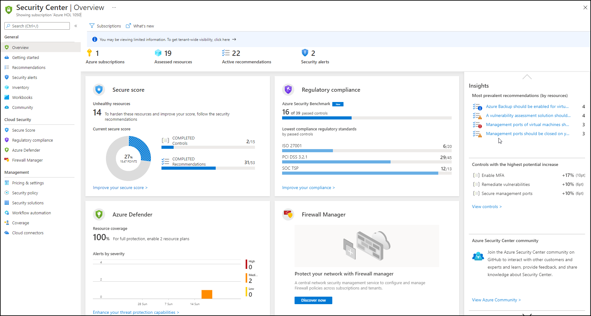
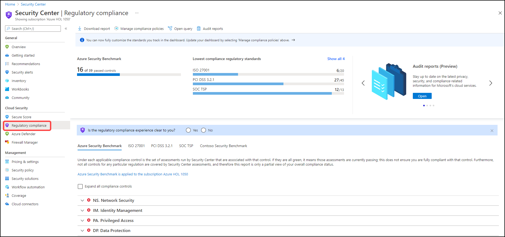
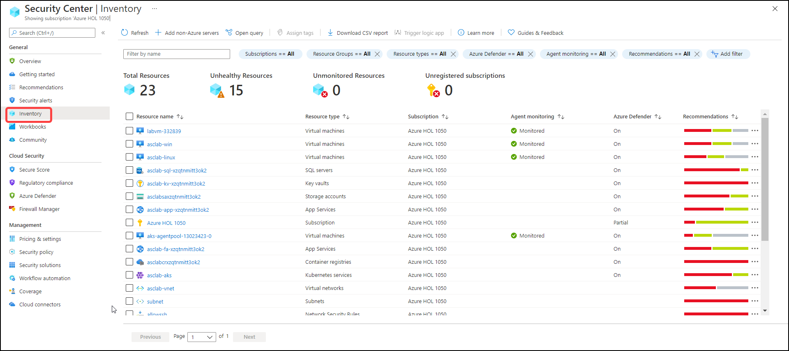
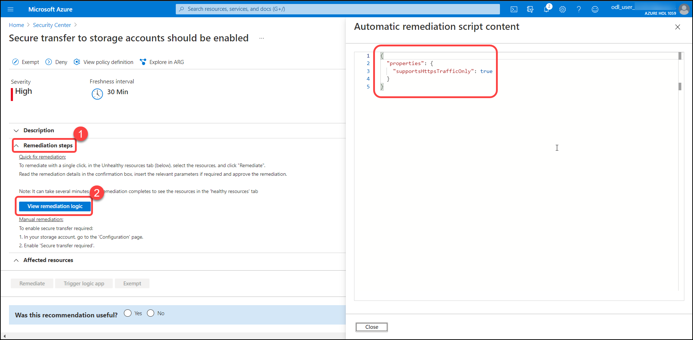
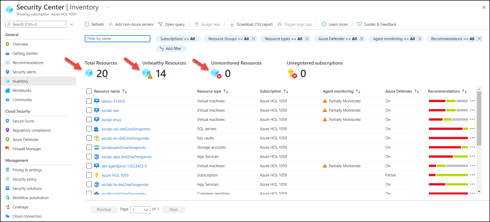
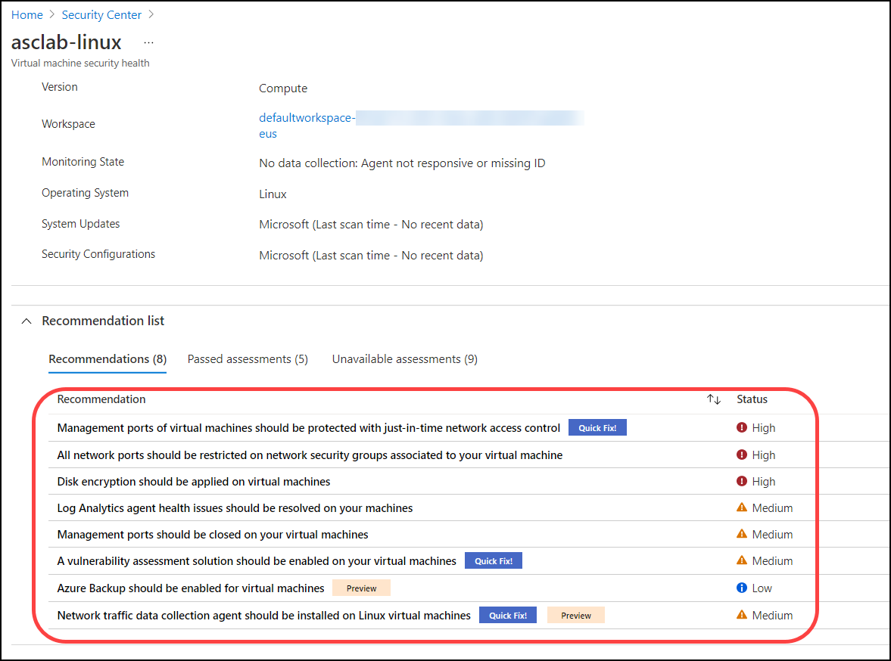

# Module 2 - Exploring Azure Security Center

<p align="left"></p>

#### 🎓 Level: 100 (Beginner)
#### ⌛ Estimated time to complete this lab: 60 minutes

## Exercise 1: Understanding Azure Security Center dashboard

1.	Navigate to the **Azure Portal** (https://portal.azure.com) using the credentials you created in the previous module.
2.	From the left navigation pane, click on **Security Center**. You can also navigate to Azure Security Center dashboard by using the top search bar.
3.	On the **Overview** blade notes that it now provides a unified view into the security posture and includes multiple independent cloud security pillars such as **Azure Secure Score, Regulatory Compliance and Azure Defender**. 
Each of these pillars also has its own dedicated dashboard allowing deeper insights and actions around that vertical, providing easy access and better visibility for security professionals.

> ❗ Important: <br>
> It takes few hours for all tiles on the oerview page to update.



4.	Note the **top menu** bar which allows to view and filter subscriptions by selecting the **subscriptions button**.
In this lab we will use only one but selecting different/additional subscriptions will adjust the interface to reflect the security posture for the selected subscriptions.

5.	Click on the **What’s new** button – a new tab opens with the latest release notes where you can stay current on the new features, bug fixes and more.
6.	Note the **high-level numbers** at the top menu; This view allows you to see a summary of your subscriptions, active recommendations, security alerts alongside with connected cloud accounts (AWS account and GCP projects – will be discussed in the next modules).


7.	From the top menu bar, **click** on **Azure subscriptions**.
8.	On the **Coverage** page, note that **Azure subscription 1** is fully covered – means that your subscription is covered by Azure Defender. (you should also see a message: *Looking good! The subscriptions below are fully protected*)


> ⭐ Good to know: <br>
> This page shows a list of subscriptions and their coverage type. You can use this page to find subscriptions that are not covered by Azure Security Center and help you identify “shadow IT” subscriptions.

9.	Go back to the **Overview** page, and look at the **Secure Score** tile, you can see your current score along with the number of completed controls and recommendations. Clicking on this tile will redirects you to drill down view across subscriptions.


> ⭐ Good to know: <br>
> The higher the score, the lower the identified risk level.

10.	On the **Azure Defender** tile, you can see the coverage of your connected resources (for the currently selected subscriptions) and the recent alerts, color-coded by severity. Your current resource coverage should be **100% which means full protection**. Clicking on this tile will redirects you Azure Defender dashboard.


11.	On the **Regulatory Compliance** tile, you can get insights into your compliance posture based on continuous assessment of your both Azure and hybrid cloud environments. This tile shows only 4 standards which are SOC TSP, ISO 27001, PCI DSS 3.2.1 and Azure CIS 1.1.0. Clicking on this tile will redirects you to Regulatory Compliance dashboard – where you can add additional standards and explore the current ones.



12.	The last tile on the overview page is the **Inventory** – it shows the number of unmonitored VMs alongside with the total covered resources - **you should expect to have zero unmonitored VMs**.
Resources are divided by their health status. Clicking on this tile will redirects you to the asset inventory dashboard where you can explore your resource and their security posture – see a dedicated exercise below.

> ❗ Important: <br>
> Unmonitored VMs are considered to as virtual machines that have Log Analytics agent deployed, but the agent isn't sending data or has other health issues.





## Exercise 2: Exploring Secure Score and Recommendations

**Exploring Secure Score**

Previously, we briefly explored the Secure Score tile on the overview page. Now let’s dive into this capability and the associated recommendations. Azure Security Center continually assesses your resources. All findings are aggregated into a single score (Secure Score) which measures your current security posture of your subscription/s; the higher the score, the lower the identified risk level.
Exploring secure score

1.	Go to the **Azure Security Center Overview blade**.
2.	From the left navigation pane, under the **Cloud Security** section, press on the **Secure Score** button.
3.	On the Secure Score page, **review your current overall secure score**.

> ⭐ Notice: <br>
> Your score is shown as a percentage value, but you can also see the number of points which the score is being calculated based on. See the following example: <br>
> <br>
> For more information on how the score is calculated, [refer to the secure score documentation page](https://docs.microsoft.com/en-us/azure/security-center/secure-score-security-controls#how-your-secure-score-is-calculated).

4.	On the left side of the page, you can notice the **subscriptions with the lowest scores** – this section helps in prioritizing working on subscriptions. Since this demo is based on a single subscription, you will see only one.

5.	On the bottom part, you can see a list of subscriptions and their current score. To view the recommendations behind the score, click on **view recommendations**.

**Exploring Security Controls and Recommendations**

1.	On the recommendations page, pay attention to the first part of the page; the **summary view** which includes the current score, progress on the recommendations (both completed security controls and recommendations) and resource health (by severity).
2.	On the top menu, click on **Download CSV report** button – this allow you to get a snapshot of your resources, their health status and the associated recommendations. You can use it for pivoting and reporting.
3.	Notice the second part of the page; here you have a **list of all recommendations grouped by security controls**:

> ⭐ Notice: <br>
> -	Each security control is a logical group of related security recommendations and represents a security risk you should mitigate.
> -	Each control has its own score which contributes to the overall secure score.
> -	Address the recommendations in each control, focusing on the controls worth the most points.
> -	To get the max score, fix all recommendations for all resources in a control.
> To understand how the score and the downstream recommendations are calculated, please visit our official [documentation](https://docs.microsoft.com/en-us/azure/security-center/secure-score-security-controls#calculations---understanding-your-score "Understanding your score calculation").

4.	On the right side, **switch the toggle button to OFF** to disable the group by controls view – now you should get a flat view of all recommendations. **Switch it back to ON**.


5.	Look for the **Encrypt data in transit** security control. Notice its max score 4 and the potential increase for the score. You should have three recommendations within this control.
6.	Click on the **Secure transfer to storage accounts should be enabled** recommendation. As you can see, this recommendation has the **Quick Fix** avaialble.

> ⭐ Notice: <br>
> Quick Fix allows you to remediate a group of resources quickly when possible with a single click. This option is only available for supported recommendations and enables you to quickly improve your secure score and increase the security in your environment.

7.	On the top section, notice the following:

* Title of the recommendation: **Secure transfer to storage accounts should be enabled**
* Top menu controls: (Enforce and Deny buttons on supported recommendations): **Deny**
* Severity indicator: **High**
* Refreshens interval on supported recommendations: **30 Min**


8. The next important part is the **Remediation Steps** which contains the remediation logic. As you can see, you can remediate the select resource/s either by following the step-by-step instructions, use the provided ARM template or REST API to automate the process by yourself or use the Quick Fix button which triggers the ARM call for you.

* Click on the **view remediation logic*
* Notice the automatic remediation script content (ARM Template):

```json
{
  "properties": {
    "supportsHttpsTrafficOnly": true
  }
}
```





9.	On the bottom part, **select a resource** (the single storage account on the unhealthy tab) and **click Remediate**.

10. On the right pane, review the implications for this remediation and press **Remediate 1 resource**.

11. Wait for a notification: ✅ **Remediation successful** - Successfully remediated the issues on the selected 
resources. Note: It can take several minutes after remediation completes to see the resources in the 'healthy resources' tab.

12.	Return to recommendations list. Expend the "Manage access and permissions" security control, you can now see recommendations flagged as `Preview`. Those aren’t included in the calculation of your score. They should be still remediated, so that when the preview period ends, they will contribute towards your score.

### Exercise 3: Exploring the Inventory capability

Asset inventory dashboard allows you to get a single pane of glass view to all your resources covered by Azure Security Center. It also provides per-resource visibility to all Security Center’s information and additional resource details including security posture and protection status. Since this dashboard is based on Azure Resource Graph (ARG), you can run queries across subscriptions at scale quickly and easily.

1.	From Security Center’s sidebar, select **Inventory**
2.	Hover to the **Summaries strip** at the top of the page.



3.	Notice the total number of resources: **20**

> ⭐ Notice: <br>
> The total number of resources are the ones which are connected to Security Center and NOT the total number of resources that you have in your subscriptions/s.

4.	Notice the number of **unhealthy resources: 14** (resources with active recommendations based on the selected filter)
5.	Notice the **unmonitored resources: 0** (indicates if there are resources with Log Analytics agent deployed but with health issues). Since we enabled the auto-provisioning in the previous module, all existing VMs are covered and connected = monitored.
6.	Use the **Filter by name** box to search for **linux**. You should now see a filtered view containing your desired resource: *asclab-linux*
7.	Hover on the **recommendations** column to see a tooltip with the active recommendations. You should expect to see **8 active out of 16** recommendations – these are the recommendations you must attend.
8.	Open the resource health pane by selecting the resource. Click on **asclab-linux**. You can also right click on any resource and select **view resource**.


9.	On the resource health pane for **asclab-linux**, review the virtual machine information alongside with a recommendation list.



10.	From the filter menu, select the **Resource Group** filter and then **asclab-asc**. Using this filter, you can see all resources related to the predefined Kubernetes resources which are monitored with no active recommendations. Clear the filter by selecting **Resource Group** and then **Select all**.


> Notice! The entire grid can be filtered and sorted

11.	From the filter menu, select **Recommendations**, uncheck **select all** option and then select the **Auditing on SQL Server should be enabled**. You can also use the search area within the filter to better find across the list. Clear your filter.
12.	Tag is very common asset management in Azure to do asset management. Using this view, you can assign tags to the filtered resources:

* Filter the **Resource type** column to include only **App Services**.
* **Select** the two app service named as *asclab-fa-xx* and *asclab-app-xx*
* From the top menu, click **Assign tags**
* Assign `Environment` as the name and  `Production` as the value.
* Click **Save**.


13.	Notice the **Security findings** filter – it allows you to find all resources that are vulnerable by a specific vulnerability. You can also search for CVE, KB ID, name and missing update.
14.	From the filter pane, select **Azure Defender** and value **On**. On the **Resource Group** select **asclab**. From the top menu bar, click on **Download CSV report**. You will get a snapshot to work on it offline already filtered. You can also right click on any of the resource and upgrade to Azure Defender plan (when applicable).


15.	From the top menu, click on **Open query**. On the resource graph explorer blade, click on **Run Query**. You should now have the same list of resources and columns like in the previous step. This query can be editable for your needs and here it gets very powerful.


16.	Save the query for later use by clicking on **Save as** from the top menu. You can use it to create periodic reports. Name the report as *asc-filtered-query* and select **save**.

> ⭐ Good to know: <br>
> Inventory dashboard is fully built on top of Azure Resource Graph (ARG) which stores all of ASC security posture data and leveraging its powerful KQL engine.
> It enables you to reach deep insights quickly and easily on top of ASC data and cross reference with any other resource properties.

### Continue with the next lab: [Module 3 - ASC Security Policy](../Modules/Module-3-ASC-Security-Policy.md)